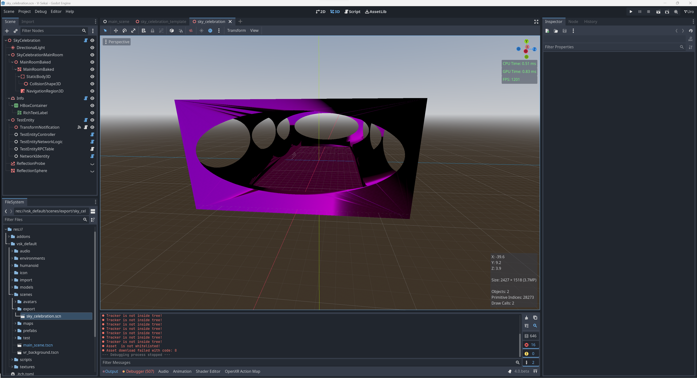
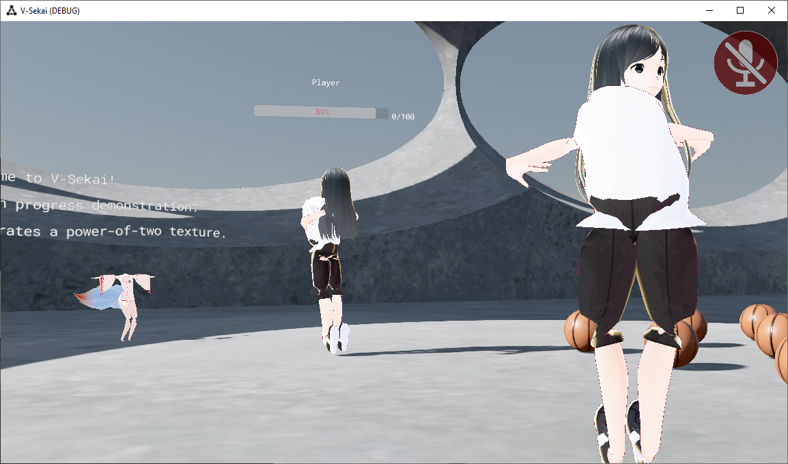

# Changelog 2022-11

## 2022-10-05

Restored V-Sekai-Game home.

Worked on EWBIK as a git branch.

## 2022-11-22

Game releases are working again.

## 2022-11-29 - Lyuma

V-Sekai-game Player spawning should be working again (see their name tag at least). There's an issue with the default sky_celebration map caused by "TestEntity" which has scene_file_path=="" and that breaks the validation logic, preventing the player from spawning, and most default maps don't work. You need to use Mobile Dragon Shop (very dark) or Tokyo Map

Note that avatars are currently not working. I think I'm getting closer to identifying where the validation is causing trouble.

### Current state of V-Sekai-Game

We are working on a v2 of the network architecture based on Godot's network spawn & sync system, so a lot of the code I'm editing right now is kind of legacy at this point. The new network implementation should drastically simplify the code and eliminate dozens of complex GDScript files from being needed. I still want to get this demo stable, since we will still be using the player controller and avatar loader from it

The new v2 network demo can be found at https://github.com/V-Sekai/net_demo if you're curious. There's no VR support planned for net_demo, but it should serve as a strong foundation going forward.

Avatars should show up again. There was some code mistake that triggered only when the default "mirror" was disabled and caused avatars not to instantiate, but I didn't notice because I had turned it on in my checkout

I also fixed the default sky celebration map

Avatar bone rotations are currently broken with this setup. Seems like the head always faces a certain direction:

